<!-- hero: pixel wordmark (cascades in, then types a tagline) beside a
     neofetch-style info card (lines slide in). both are self-contained SVGs
     with embedded CSS/SMIL animation -- no JS, no third-party widgets.
     regenerate: python scripts/make_wordmark_svg.py && python scripts/make_info_card.py -->

<h3><code>rishab@github ~ $ whoami</code></h3>

<table>
<tr>
<td valign="top"></td>
<td valign="top"></td>
</tr>
</table>

 

<!-- live contribution graph: real data, boxes reveal cell by cell.
     refreshed daily by .github/workflows/update-profile-art.yml -->

<h3><code>rishab@github ~ $ ./contributions.sh</code></h3>

 
 

<h3><code>rishab@github ~ $ cat about.md</code></h3>

<table>
<tr>
<td width="860" align="left">
<b>AI Engineer &amp; Full Stack Developer</b> building AI-powered products, intelligent automation systems, and scalable web platforms.  
I work with modern AI models, agentic architectures, APIs, and full stack technologies to turn ideas into efficient, real-world solutions.  
Driven by the intersection of AI, engineering, and product design — crafting experiences that are not only functional, but intuitive and impactful.
</td>
</tr>
</table>

 

<h3><code>rishab@github ~ $ ./stack.sh</code></h3>

 

<h3><code>rishab@github ~ $ ./links.sh</code></h3>

 

